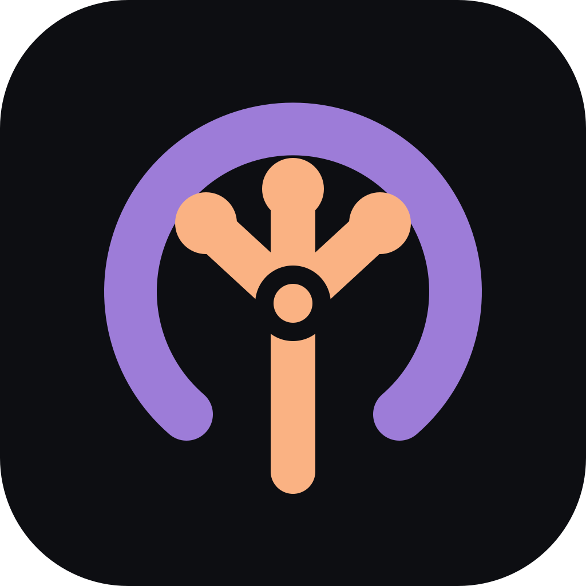

<div align="center">



# Zuno

### 面向持久、受约束任务的 Rust 编程 Agent

[](https://github.com/sunerpy/zuno/actions/workflows/ci.yml)
[](https://github.com/sunerpy/zuno/releases)
[](../../LICENSE)
[](../../rust-toolchain.toml)

[安装](#安装) · [快速开始](#快速开始) · [运行时](#运行时与扩展) · [文档](#文档)

[English](../../README.md) · [**简体中文**](./README.zh-CN.md)

</div>

Zuno 是一个本地编程 Agent，提供内置终端界面、无界面执行、ACP 和 HTTP 服务。
会话存储在 SQLite 中，运行时是原生 Rust 二进制，不依赖 Node 或 Python。

项目仍处于活跃的预发布开发阶段。Zuno 使用自己的配置、命令、数据格式、工具参数和扩展协议。

## 为什么选择 Zuno

- **工作可以从中断处继续。** Prompt、工具结果、重试、计划和子 Agent 报告都属于持久会话状态；
  重新打开会话时会恢复已记录的工作。
- **Agent 角色有固定能力上限。** `plan` 只读，`build` 负责端到端交付，`deep` 处理困难的
  跨领域改动且不会递归委派。
- **命令权限是显式的。** 权限规则、风险检查和 OS 沙箱彼此独立。受限模式无法部署请求的
  沙箱时默认拒绝执行，只有受信策略可以明确选择原生执行。
- **Provider 可替换。** OpenAI、Anthropic、Google、Bedrock 和 OpenAI 兼容端点均使用
  原生 Rust transport。
- **所有客户端共用一个运行时。** TUI、headless、ACP 和 HTTP 消费相同的命令、事件、
  inbox 与 projection。

## 安装

发行版安装器会下载当前平台的归档，并在解包前使用同一 release 的 `SHA256SUMS` 校验。

```sh
# Linux 与 macOS
curl -fsSL https://raw.githubusercontent.com/sunerpy/zuno/main/scripts/install.sh | sh
```

```powershell
# Windows PowerShell
irm https://raw.githubusercontent.com/sunerpy/zuno/main/scripts/install.ps1 | iex
```

从源码安装：

```sh
cargo install --git https://github.com/sunerpy/zuno zuno-cli --locked
```

Zuno 需要 `rg`（ripgrep）14 或更新版本。Linux 上的受限 Shell 还需要 bubblewrap 0.8.0
或更新版本。发行目标、手工摘要校验和沙箱要求见[安装指南](../guide/installation.md)。

已安装的发行版可以原地更新：

```sh
zuno self-update --check
zuno self-update
```

完整更新契约见 [Self-update](../reference/self-update.md)。

## 快速开始

Zuno 不预设 Provider 或模型。可以从仓库内已校验的 `myopenai` 示例开始：

```sh
install -d -m 700 "${XDG_CONFIG_HOME:-$HOME/.config}/zuno"
install -m 600 examples/config/zuno.json \
  "${XDG_CONFIG_HOME:-$HOME/.config}/zuno/zuno.json"
$EDITOR "${XDG_CONFIG_HOME:-$HOME/.config}/zuno/zuno.json"
printf '%s' "$MYOPENAI_API_KEY" | zuno providers login --provider myopenai
zuno debug config
zuno models myopenai --verbose
```

示例使用原生 `openai` transport。若使用预编译版本且没有源码 checkout，可将
[`examples/config/zuno.json`](../../examples/config/zuno.json) 的内容写入同一配置路径。

先用只读任务验证整条链路：

```sh
zuno run --agent plan "概述这个仓库的架构"
```

然后启动终端应用，或直接运行一个有明确边界的任务：

```sh
zuno
zuno run "为 users 接口增加分页并运行测试"
```

Provider 配置、沙箱检查、凭据和首次运行排障见[快速开始](../guide/quick-start.md)。

## 运行时与扩展

Zuno 运行时由类型化 Rust `Component` 组合而成。`HarnessProfile` 以事务方式挂载组件；
每次注册都会返回只撤销该副作用的 disposer。`AgentDriver` 控制循环，`ToolManifest`
控制模型可见的工具面。

```rust
let profile = zuno_harness::profile_with_tools(
    "release-review",
    Arc::new(ReleaseReviewDriver::new()),
    ToolManifest::new([BuiltinSlot::Read, BuiltinSlot::Grep, BuiltinSlot::Task])?,
    ToolContributions::default(),
);
```

Agent、Workflow、Skill、WASI Component 和受控进程工具共用同一套 Profile 生命周期。
组装后的模型请求会在发往 Provider 前持久化为 `session.prompt.assembled`。

组件模型见 [Harness Runtime](../harness-runtime.md)，扩展包格式与能力授权见
[插件与扩展](../plugins.md)。设计取舍记录在
[Harness 对比](../design/harness-comparison.md)与
[DSH alpha.2 采用分类账](../design/dsh-alpha2-adoption-ledger.md)，客户端共享边界见
[Client interfaces](../design/client-interfaces.md)。

## 文档

完整文档发布在 [zuno.firlab.app](https://zuno.firlab.app)，源文件位于
[`docs/`](../README.md)。常用入口：

- [快速开始](../guide/quick-start.md)：Provider 配置、凭据、首次运行
- [配置参考](../reference/configuration.md)与 [Provider](../reference/providers.md)
- [权限与沙箱](../guide/permissions.md)：Shell 权限边界
- [附件](../reference/attachments.md)：图片与 `@file` 输入
- [导出与导入](../reference/portable-bundles.md)：可移植配置包
- [Zed ACP](../reference/zed-acp.md)：编辑器与其他 ACP 客户端
- [FAQ](../faq.md)：故障排查

## 构建与开发

```sh
make build
./dist/zuno --version --long
cargo test --workspace
cargo clippy --workspace --all-targets
cargo fmt --all --check
```

`make build` 保留 `target/debug` 中的 Cargo 产物，并将可运行二进制放到 `dist/zuno`。
仓库流程与必跑检查见 [CONTRIBUTING.md](../../CONTRIBUTING.md)。

## 许可证

本项目采用 [MIT License](../../LICENSE)。
